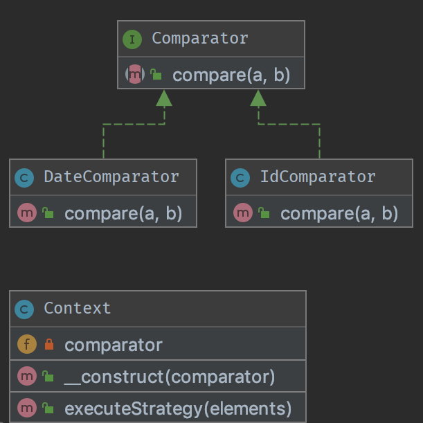

## Strategy Pattern

### Definition  
Strategy is a behavioral design pattern that lets you define a family of algorithms,
put each of them into a separate class, and make their objects interchangeable. This pattern is used when you might have multiple way to solve a problem, and you want to let the client choose which one to use.

### Purpose
To separate strategies and to enable fast switching between them. Also this pattern is a good alternative to inheritance (instead of having an abstract class that is extended).

### Example:
login with email or mobile number  
simplify unit testing switching between files and memory storage  

### Diagram Example

### Laravel Usage:
If you use Laravel then you are probably used to the config options, such as in
**config/logging.php ** 
you have this line:  

**'default' => env('LOG_CHANNEL', 'stack')**.  

You can set it to various options such as 'stack', 'stderr', 'single' - each of these will
load a different logging class - this uses the strategy pattern.
 