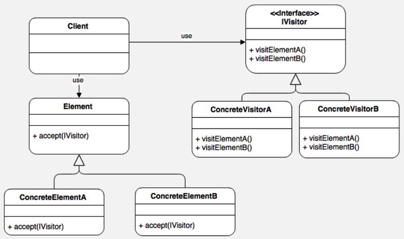

## Factory Method Pattern

### Definition  
Factory method is a creational design pattern which solves the problem of creating product objects without specifying their concrete classes.

The Factory pattern uses factory methods to deal with the problem of creating objects by specifying their concrete classes. The factory is responsible for creating objects, not the clients. Multiple clients can call the same factory.
### Purpose
The good point over the SimpleFactory is you can 
sub class it to implement different ways to create objects.

For simple cases, this abstract class could be just an interface.

This pattern achieves the Dependency Inversion principle. It means the FactoryMethod class depends on abstractions, not concrete classes. This is the real trick compared to SimpleFactory or StaticFactory.

### Example:
Multi vendor Coffee shop  
Multiple Burgers ,pizza etc

### Diagram Example

### Code Example

([Example ](./RestaurantController.php))

### Laravel Usage:
Laravel View  
Multiple Email Driver>br>
Multiple Database Connection